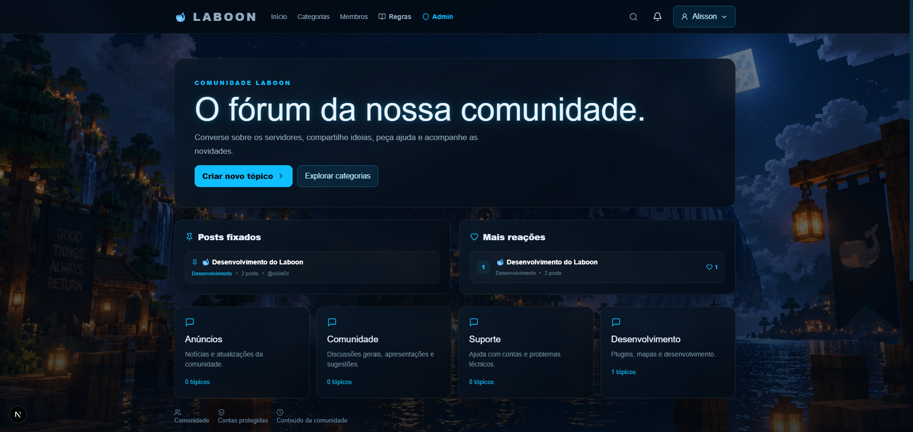

# 🐋 LaboonMC

> **Um projeto Minecraft em desenvolvimento.**

O **Laboon** é um projeto de servidor Minecraft que está sendo desenvolvido com foco em uma experiência completa de minigames, sistemas de lobby e uma infraestrutura preparada para crescer junto com a comunidade.

Este repositório público tem como objetivo **apresentar o Laboon e acompanhar seu desenvolvimento**.

---

## 💬 Laboon Fórum

O primeiro sistema apresentado publicamente é o **Laboon Fórum**.

Um espaço criado para a comunidade acompanhar o projeto, conversar, compartilhar ideias e acompanhar as novidades do Laboon.

### 📸 Preview

> As imagens utilizadas neste README estão disponíveis na pasta [`LaboonForum`](./LaboonForum).

---

## 🚧 Desenvolvimento

O Laboon ainda está em desenvolvimento.

Novos sistemas e funcionalidades serão apresentados conforme forem implementados e testados.

Algumas das áreas do projeto incluem:

* 🏠 Lobby
* 🎮 Minigames
* ⚔️ Sistema de partidas
* 🌐 Infraestrutura distribuída
* 👤 Sistema de jogadores
* 📊 Estatísticas
* 🏆 Rankings
* 💎 Ranks e benefícios
* 🎨 Cosmetics e Gadgets
* 🔄 Comunicação entre servidores

---

## 📌 Objetivo deste repositório

Este repositório é **público** e serve principalmente para:

* Apresentar o Laboon.
* Mostrar o desenvolvimento do projeto.
* Compartilhar imagens e novidades.
* Registrar funcionalidades que já estão funcionando.
* Permitir que a comunidade acompanhe a evolução do servidor.

O código e os componentes internos do Laboon podem estar distribuídos em outros repositórios.

---

## 🐋 Acompanhe o desenvolvimento

O Laboon está sendo construído aos poucos.

Novas funcionalidades, imagens e atualizações serão adicionadas conforme o projeto evoluir.

**LaboonMC — em desenvolvimento.** 🚀
